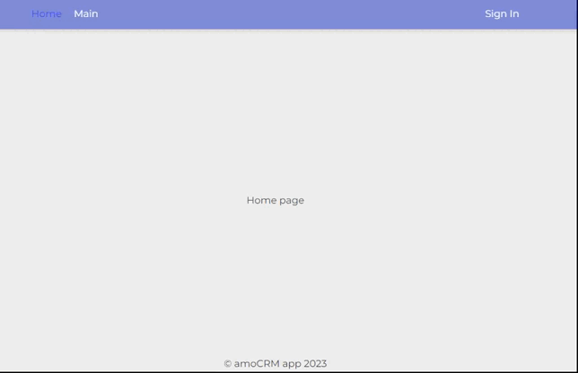

## Используемые технологии

- Vue 3

- Pinia

- TypeScript

- Vite

- amoCRM API

- Nest.js

- Node.js

- Express

- MongoDB

## Задание

### Фронтэнд

Сверстать на Vue3 следующие компоненты:

- Выпадающий список (dropdown)

- Кнопка

- Область отображения результата списка созданных ID сущностей. 

Преимуществом будет:

- реализация на Pinia

- использование Composition API + TypeScript

- реализация переиспользуемых компонентов

Сохранить стилистику неактивной кнопки, активной кнопки и [прелоадера](https://monosnap.com/file/Ikchjl7btT64AaWsv9jg3YQD9Ykt55).

Функционал фронтенда

1. В выпадающем списке пользователь выбирает одну из трех сущностей, которую нужно создать в amoCRM: Сделка, Контакт, Компания.

2. По нажатию на кнопку "Создать" с фронтенда уходит POST-запрос на **API amoCRM**, создается выбранная сущность, в теле ответа API присылает ID созданной сущности и http код ответа 200, либо текст ошибки и соответствующий http-код ответа.

3. В случае успешного создания сущности отображаем название сущности и её идентификатор в области отображения результатов. Результаты накапливаем, должны отображаться все ID и имена сущностей, созданных с момента открытия окна браузера.

В выпадающем списке отображаем четыре элемента:

- Не выбрано

- Сделка

- Контакт

- Компания

По-умолчанию в списке выбран первый элемент "Не выбрано". При выбранном элементе "Не выбрано" кнопку "Создать" делаем неактивной (на белом фоне). При иных выбранных элементах кнопку делаем активной (на синем фоне).

Будет плюсом: стек реализации задачи: **Vue3** (**Composition API** + **TypeScript**), **Pinia**, **Vite**, **axios**

### Работа с API amoCRM

Реализовать следующий функционал:

1. Авторизоваться по **OAuth2** и получить токен для API

2. Создать запрашиваемую сущность "Сделка", "Контакт" или "Компания" (выбранную на фронте сущность в выпадающем списке) с помощью POST-запроса

3. Отправить в ответе полученный ID сущности

Будет плюсом: если работа с **API amoCRM** будет реализована на **NestJS** (бекенд часть приложения), и именно роуты бекенда будет использовать фронтенд.
